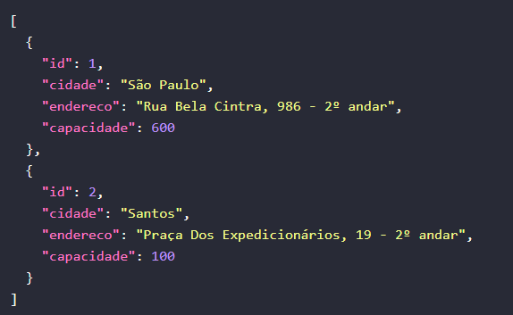
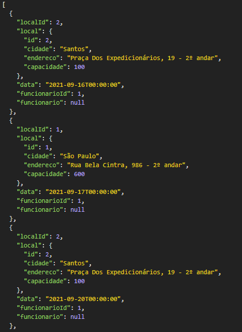
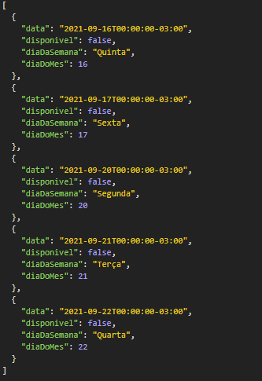
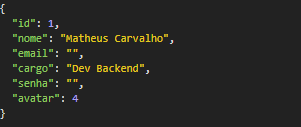
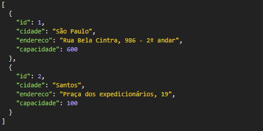

# 🧡 Hackathon-FCamara API

API tem como objetivo fornecer o serviço para agendamento de colaboradores da FCamara em seus escritórios ou filiais, visando garantir a segurança respeitando a capacidade máxima de cada ambiente de acordo com a legislação imposta por conta da pandemia (COVID-19).

## ⚙️ Executando o projeto

### Pré-requisitos

- **[GIT](https://git-scm.com/)**
- **[MySQL](https://dev.mysql.com/downloads/)**
- **[.Net Core](https://dotnet.microsoft.com/download/dotnet/3.1)**
- **[Visual Studio](https://visualstudio.microsoft.com/downloads/) ou [VSCode](<[VSCode](https://code.visualstudio.com/)>)**

### Instruções

Para começar siga os próximos passos.

### **Configurando o banco de dados**

#### Após seguir os passos de instalação do MySQL, abra o Mysql Workbench para criar o banco de dados. Dentro do Workbench, digite:

```
create database (nome_do_banco) e pressionar Ctrl + enter
```

### **Clone o repositório e acesse com o editor de código escolhido**

```
git clone https://github.com/Squad-17/Hackaton-API.git
```

### **Conectando o banco de dados ao Entity Framework**

#### Abra o arquivo `appsettings.json` e na propriedade `MyCon` insira a string de conexão para o banco de dados

```
Se nada foi alterado durante a instalação, sua string de conexão deve ser algo parecido com isso:

server=localhost;port=3306;database=nome_do_banco;uid=root;password=senha"

onde (nome_do_banco) é o nome que foi dado ao banco no primeiro passo e senha é a mesma senha criada na instalação do MYSQL
```

## **Executando o projeto**

<details>
  <summary>Com VSCode </summary>

### **Instalar extensões necessárias**

- [C#](https://marketplace.visualstudio.com/items?itemName=ms-dotnettools.csharp)

### **Instale as ferramentas do Entity framework**

```
Na linha de comando (Ctrl + ") digite:

dotnet tool install --global dotnet-ef

e pressione enter. Após isso, digite:

dotnet ef

caso a instalação tenha sido bem sucedida, isso será mostrado:

             ---==/    \\
       ___  ___   |.    \|\
      | __|| __|  |  )   \\\
      | _| | _|   \_/ |  //|\\
      |___||_|       /   \\\/\\

Entity Framework Core .NET Command-line Tools 2.1.3-rtm-32065

```

### **Criando as tabelas**

```
Com tudo corretamente configurado, abra novamente a linha de comando (Ctrl + ") e digite:

dotnet ef database update

após a execução desse comando, as tabelas no banco de dados serão criadas
```

### **Executando o projeto**

```
Agora, o projeto está pronto para ser iniciado, basta executar o comando:

dotnet run

o projeto será executado e estará disponível na rota https://localhost:5001
```

</details>

<details>
  <summary>Com Visual Studio </summary>

### **Criando as tabelas**

```
Abra o console do gerenciador de pacotes (Ferramentas > Gerenciador de pacotes do Nuget > Console do Gerenciador de Pacotes) e entre o comando

Update-Database

esse comando criará as tabelas no banco de dados
```

### **Executando o projeto**

```
Agora, o projeto está pronto para ser iniciado, basta pressionar F5 e o projeto será executado na rota https://localhost:44346
```

</details>

<br>

### Para ter certeza que o projeto está rodando, acesse a rota:

```
https://localhost:(porta-do-projeto)/api/local
```

#### Este json deverá aparecer



#### Pronto, a API está pronta para uso 😄!!!

---

# ☕ Referência

## **Entidades**

### Funcionario

| Propriedade | Tipo      | Obrigatório  |
| :---------- | :-------- | :----------- |
| `Id`        | `inteiro` | `automático` |
| `Nome`      | `string`  | `sim`        |
| `Email`     | `string`  | `sim`        |
| `Senha`     | `string`  | `sim`        |
| `avatar`    | `enum`    | `padrão: 0`  |
| `Cargo`     | `string`  | `não`        |

### Local

| Propriedade  | Tipo      |
| :----------- | :-------- |
| `Id`         | `inteiro` |
| `Cidade`     | `string`  |
| `Endereco`   | `string`  |
| `Capacidade` | `inteiro` |

### Agendamento

| Propriedade     | Tipo      |
| :-------------- | :-------- |
| `localId`       | `inteiro` |
| `Data`          | `data`    |
| `funcionarioId` | `inteiro` |

### DiaAgendamento

| Propriedade  | Tipo      |
| :----------- | :-------- |
| `Data`       | `data`    |
| `Disponivel` | `boolean` |
| `DiaSemana`  | `string`  |
| `DiaDoMes`   | `inteiro` |

<br>

# Rest API

## Próximos agendamentos

### Requisição

```
GET /api/Agendamento/
```

### Resposta



## Agendar

### Requisição

```
POST /api/Agendamento/

Body: Objeto Agendamento
```

### Resposta


## Datas para Agendamento disponiveis no local

### Requisição

```
  GET /api/Agendamento/disponiveis/:localId
```

### Resposta



## Cancelar agendamento

### Requisição

```
  DELETE /api/Agendamento/

  Body: Objeto agendamento
```

<br>

## Cadastrar Funcionario

### Requisição

```
  POST /api/Funcionario/cadastrar

  Body: Objeto Funcionario
```

## Login Funcionario

### Requisição

```
  POST /api/Funcionario/login

  Body: Objeto funcionário
```

## Informações do Funcionario

### Requisição

```
  GET /api/Funcionario/info
```

### Resposta



## Altera o avatar do Funcionario

### Requisição

```
  PATCH /api/Funcionario/avatar?avatar=(avatar-enum-value)
```

## Retornar Locais

### Requisição

```
  GET /api/Local/
```

### Resposta



## 📄 Documentação com Swagger

```http
  https://localhost:5001/swagger/index.html
```

## 🚀 Contribuições

- DEV

| [ <br> <sub> **`Anderson Fonseca`** </sub>](https://github.com/theandersonfonseca) |     | [ <br> <sub> **`Matheus Carvalho`** </sub>](https://github.com/Matheus-Galdino) |     | [ <br> <sub> **`Renan Marques`** </sub>](https://github.com/Re04nan) |     |
| ------------------------------------------------------------------------------------------------------------------------------------------------------------ | --- | --------------------------------------------------------------------------------------------------------------------------------------------------------- | --- | ---------------------------------------------------------------------------------------------------------------------------------------------- | --- |

- UX

| [ <br> <sub> **`Julia Resende`** </sub>](https://www.linkedin.com/in/juliaresende/) |     | [ <br> <sub> **`Thiago Falchet`** </sub>](https://www.linkedin.com/in/thiago-falchet/) |     |
| ----------------------------------------------------------------------------------------------------------------------------------------------------------------------------------------------------------------------------------------------------------------------------------------- | --- | ---------------------------------------------------------------------------------------------------------------------------------------------------------------------------- | --- |
